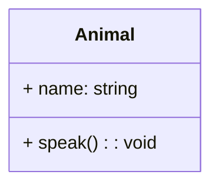
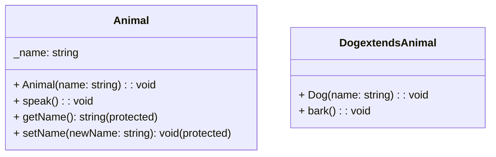
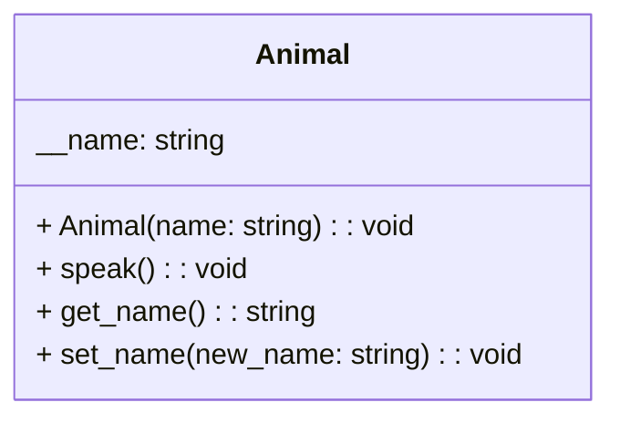
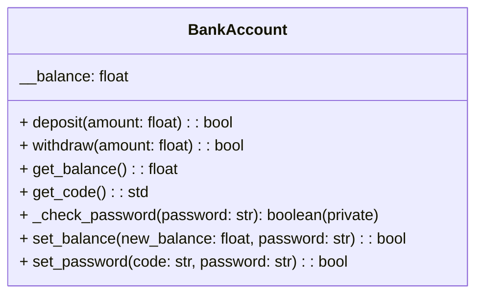
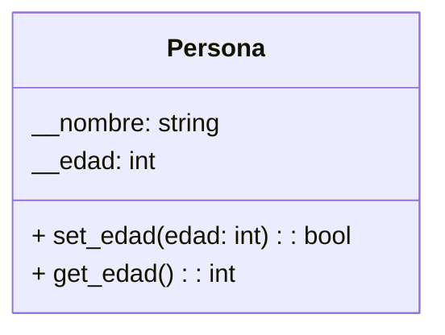
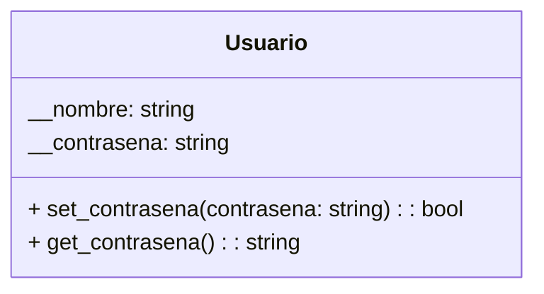
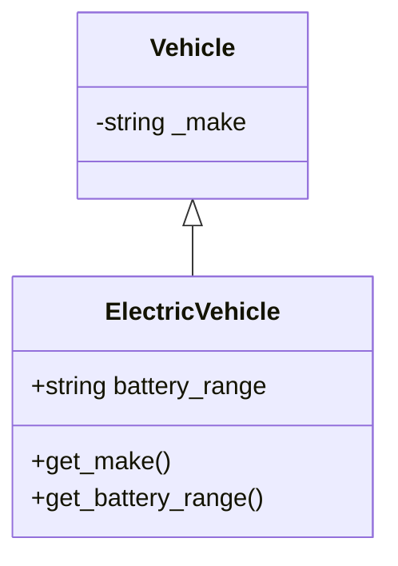

# Programación Orientada a Objetos - UNAL

## Clase 9: Encapsulamiento

### Definición
El encapsulamiento es un pilar fundamental de la POO que se basa en *restringir los detalles internos de un objeto (atributos y métodos) a otros objetos*. Solo se expone una interfaz pública para interactuar con el objeto.

Qué se logra con el encapsulamiento:

- **Protección de datos:** Evita la modificación accidental o malintencionada de los atributos internos del objeto.
- **Mejora la modularidad:** Permite crear objetos independientes y reutilizables.
- **Facilita el mantenimiento:** Simplifica la comprensión y el cambio del código al ocultar la complejidad interna.
- **Aumenta la flexibilidad:** Permite modificar la implementación interna del objeto sin afectar a los usuarios externos.
- **Mejora la seguridad:** Protege información sensible del objeto.

### Implementación 
Si bien Python no tiene un mecanismo de encapsulamiento puro como Java o C++, se puede simular (se tiene la convención...pero es burlable).

- **Public:** Por defecto, todos los miembros de una clase son públicos.
- **Protected (_):** Se indica con un prefijo de un guion bajo. Son accesibles dentro de la clase y sus subclases.
- **Private (__):** Se indica con un prefijo de dos guiones bajos. Python realiza un cambio de nombre (name mangling) para hacerlos inaccesibles desde fuera.

**Ejemplos:**

**Public**


```python
# Public
class Animal:
    def __init__(self, name):
        self.name = name

    def speak(self):
        print(f"El animal {self.name} dice algo")

animal = Animal("Perro")
animal.speak()
print(f"Nombre del animal: {animal.name}")
```


**Protected**



```python
# Protected
class Animal:
    def __init__(self, name):
        self._name = name

    def speak(self):
        print(f"El animal {self._name} dice algo")

class Dog(Animal):
    def bark(self):
        print(f"El perro {self._name} ladra")

dog = Dog("Toby")
dog.speak()

# try 
# dog._name = "Fido"
```


**Private**


```python
# Private
class Animal:
    def __init__(self, name):
        self.__name = name

    def speak(self):
        print(f"El animal {self.__name} dice algo")

    def get_name(self):
        return self.__name

    def set_name(self, new_name):
        if new_name:
            self.__name = new_name


animal = Animal("Gato")
animal.speak()
# try
# print(f"Nombre del animal: {animal.__name}")
animal.get_name()

# Se modifica el nombre usando métodos privados
animal.set_name("Michi")
animal.speak()
```

**Ejemplo cuenta bancaria:**



```python
import uuid

class BankAccount:
    def __init__(self, balance):
        self.__balance = balance
        self.__password = ''
        self.__code = uuid.uuid4()

    def deposit(self, amount):
        if amount > 0:
            self.__balance += amount
            return True
        else:
            return False

    def withdraw(self, amount):
        if amount > 0 and amount <= self.__balance:
            self.__balance -= amount
            return True
        else:
            print("El monto a retirar no puede ser mayor al saldo actual")
            return False

    def get_balance(self):
        return self.__balance

    def get_code(self):
        self.__code = uuid.uuid4()
        return self.__code 

    def set_password(self, code, password):
      if self.__code == code and not self.__password:
          self.__password
          return True, '*'*len(self.__password)
      else: 
          return False, ''
    
    def _check_password(self, password):
          return self.__password == password

    def set_balance(self, new_balance, password):
        if self._check_password(password):
            self.__balance = new_balance
            return True
        else:
            return False

account = BankAccount(balance=1000)
code = account.get_code()
account_password = "123456"
result, chars = account.set_password(code, account_password) 
print(result, f"New pass {chars}")
account.deposit(500)
account.withdraw(300)
current_balance = account.get_balance()
print(f"Saldo actual: {current_balance}")

# Modificación del saldo con contraseña incorrecta
print(account.set_balance(2000, "123"))
```

### Setters and Getters
Los setters y getters son métodos especiales que permiten controlar el acceso a los atributos privados de una clase.

+ **Setter:** Se encarga de modificar el valor de un atributo privado. Implementación: `set_<nombre_atributo>(valor)`.
+ **Getter:** Se encarga de obtener el valor de un atributo privado. Implementación: `get_<nombre_atributo>()`.

**Ejemplos:**
**Personas y edades**


```python
class Persona:
    def __init__(self, nombre):
        self.__nombre = nombre
        self.__edad = None
    # Setter
    def set_edad(self, edad):
        if edad >= 0 and edad <= 120:
            self.__edad = edad
            return True
        else:
            False
    ## Getter
    def get_edad(self):
        return self.__edad

persona = Persona("Juan")
persona.set_edad(30)
edad = persona.get_edad()
print(f"Nombre: {persona.__nombre}, Edad: {edad}")

# Asignación de un valor no válido
if persona.set_edad(-5):
  print(f"Edad después de asignación válida: {persona.get_edad()}")
else: 
  print("Proceso no completado")
```

**Contraseñas**


```python
class Usuario:
    def __init__(self, nombre):
        self.__nombre = nombre
        self.__contrasena = None

    def set_contrasena(self, contrasena):
        if len(contrasena) >= 8:
            self.__contrasena = contrasena
            True
        else:
            False

    def get_contrasena(self):
        return "********"

usuario = Usuario("Ana")
usuario.set_contrasena("Contrasena123")
contrasena = usuario.get_contrasena()
print(f"Nombre: {usuario.__nombre}, Contraseña: {contrasena}")

# Asignación de una contraseña no válida
if  usuario.set_contrasena("1234"):
  print("Contraseña no válida!")
else: 
  print(f"Contraseña asignada: {usuario.get_contrasena()}")
```

**Nota importante:** Sí se puede acceder a los atributos protegidos de una instancia en Python, pero hacerlo va en contra de las convenciones de la programación orientada a objetos. Esta convención señala a otros programadores que el atributo está destinado para uso interno dentro de la clase o en subclases, pero técnicamente sigue siendo accesible desde fuera de la clase.


### Encapsulamiento y herencia
La herencia puede complicar el encapsulamiento especialmente cuando se trabaja con atributos protegidos y privados. Los atributos protegidos son accesibles en subclases, pero los privados no lo son directamente.



```python
class Vehicle:
    def __init__(self, make):
        self._make = make  # Protegido

class ElectricVehicle(Vehicle):
    def __init__(self, make, battery_range):
        super().__init__(make)
        self.battery_range = battery_range  # Público

    def get_make(self):  # Getter para atributo protegido de la superclase
        return self._make

    def get_battery_range(self):  # Getter para atributo propio
        return self.battery_range
```


